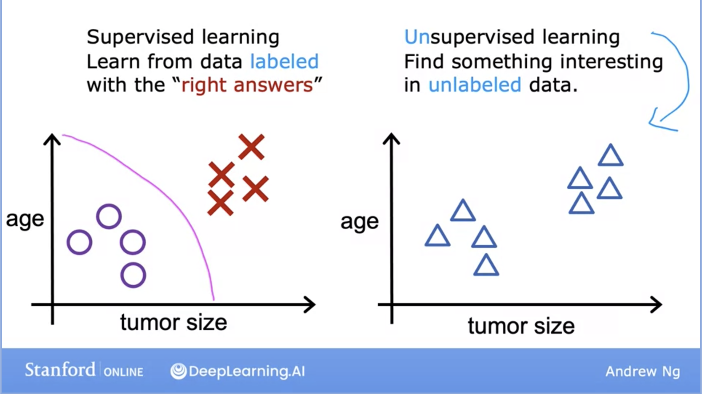
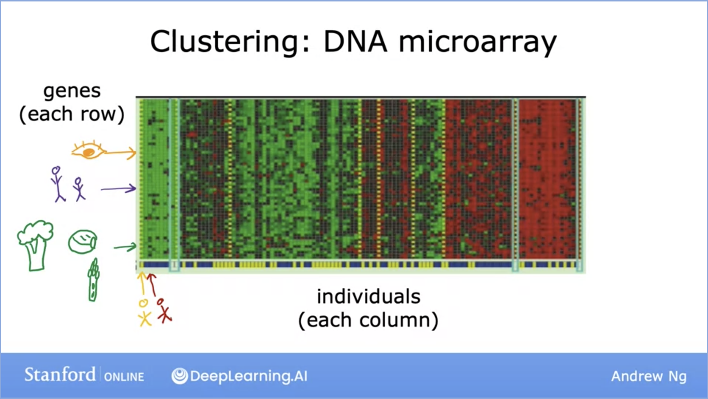
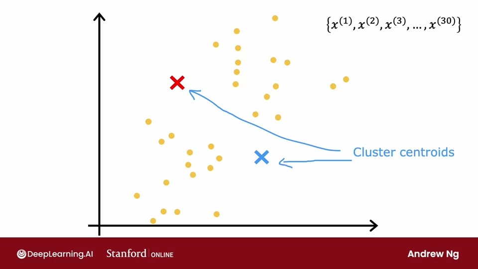

# Unsupervised Learning, Recommenders, Reinforcement Learning

## Unsupervised Learning

- After **supervised learning**, the most common form of machine learning is **unsupervised learning**. In **unsupervised** learning, we are given data without any output **labels y**.
- Data comes with **inputs x** but no **outputs y** and the algorithm has to find structure in this data.
- **Unsupervised** learning model is to find the some structure, some pattern or something interesting in the data.

- We’re not asked here to predict whether the tumor is malignant or benign because we are not given any labels of which tumor is which.
- Instead, our job is to find some pattern, or some data, or just something interesting within this unlabeled dataset.
- The reason this is called unsupervised learning is that we are not asking the algorithm to give us a “right answer”.
- In this example, our unsupervised algorithm might decide there are two clusters, with one group here and one there.
- This is a specific type of **unsupervised learning** algorithm called **clustering** algorithm because it places the unlabeled data into different clusters.

## Unsupervised learning: Clustering

- **Clustering** groups similar data points together.
- **Clustering** has many use cases:
    - It is used in Google News! Google News looks at 100’s of stories every day and clusters them together.
    
    
    
    - It is used in DNA microarray clustering. The red here might represent a gene that affects eye color, or the green here is a gene that affects how tall someone is.
        - You can run a clustering algorithm to group different types of individuals together based on categories the algorithm has automatically decided.
    - It is used in grouping customers in different market segments to better understand a company’s consumer base. This could help in improving marketing strategies for each group.

### K-means Algorithm

- The first thing that K-means does is it will take a random guess at where might be the centers of the clusters that you ask it to find.
- It will randomly pick two points at where might be the centers of the two different clusters, This is just a random initial guess and they’re not particularly good guesses.
- Then, **K-means** will repeatedly do two different things. The first is assign points to cluster centroids and the second is move **cluster centroids**.

- **K-means** will go through all training examples, and for each of them it will check if it closer to the red or blue cluster **centroid**.
- Then, it will assign each point to its closest **centroid**.

- Then, The algorithm will look at all of the red points and take the average of them, and move the red cross to that average location and do the same thing with blue cross.

- After repeating these two steps, You will find that there are no more changes to the colors of the points or the location of the **clusters centroids**.
- This means that at this point the **K-means algorithms** has converged

- $\mu$ are vectors that have the same dimensions as your training examples
- What happens if a cluster has zero training examples assigned to it?
    - The most common thing to do is just eliminate that cluster, you will end up with $k-1$  clusters
    - If you need $k$ clusters, you can randomly reinitialize that cluster centroid  and hope it gets assigned at some points.

- **K-means** is also optimizing a specific **cost function**

- The **cost function** for **K-means** is the average **squared distance** between every training example $x^{(i)}$ and the location of the **cluster centroid** to which the training example $x^{(i)}$ has been assigned .
- It turns out that what the **K-means** algorithm is trying to find assignments of points of **clusters** **centroid** as well as find locations of **clusters** centroid that **minimizes** the **squared** distance.
- The fact that **K-means** algorithm is optimizing a **cost function** $J$ means that it is guaranteed to converge, that is on every single iteration. The **distortion cost function** should go down or stay the same.
- How to apply **Random initialization(step 1)** in **k-means**?
    
    
    
    - When running **K-means**, you should  always choose the number of **cluster centroids $K$** to be less than the **training examples $m$**
    - In order to choose the **cluster centroids**, the most common way is to randomly pick **K training examples**.
    
    
    
    - Depending on how you choose the random initial **cluster centroids K-means** will end up picking a difference set of **clusters** for your data set.
    - You might end up with **clustering** which doesn’t look as good, this turns out to be a **local optima**, in which **k-means** tries to minimize the **distortion cost** function $j$ , but with less unfortunate **random initialization** , it happened to get stuck in a **local minimum.**
    - In order for **k-means** to find the **global** minimum, is to run it multiple times and choose the one with the lowest value for the **cost** function $j$   ****
    - Here’s the algorithm for **********************random initialization:**********************
    
    
    
- How to choose the number of **clusters** to use ****for **k-means**?
    - For a lot of clustering problems, the right value of $**k**$ is truly ambiguous.
    - There are a few techniques to try to automatically choose the number of **clusters** to use for a certain application.
        1. The ************elbow************ method(not recommended):
            1. you would run **k-means** with variety of $k$ values and plot the **cost function** $j$ as a function of the no. of clusters and pick the value that look like an **elbow**.
        
        
        
1. Evaluate $k$ based on how well it performs on the downstream purpose
    
    
    
    a. In case of running a T-shirt business, both of the solution are fine, but whether you want to use 3 or 5 clusters depends on what make sense for your T-shirt business.
    
    b. There’s a trade-off between how well the T-shirts will fit (3 or 5 sizes) or the extra costs associated with manufacturing and shipping five types of T-shirts instead of three. 
    

### Anomaly Detection Algorithm

- **Anomaly Detection** is another specific type of unsupervised learning and it is used to detect unusual events or data points
- **Anomaly detection** algorithms look at an unlabeled dataset of normal events and thereby learns to detect or to raise a red flag for if there is an unusual or an anomalous event.

- How can you have an algorithm address this problem?
    - The most common way to carry out **anomaly detection** is through a technique called **density estimation**
    
    
    
    - When you're given your training sets of **m** examples, the first thing you do is build a model for the probability of **x**.
    - The learning algorithm will try to figure out what are the values of the features x1 and x2 that have high probability and what are the values that are less likely or have a lower chance or lower probability of being seen in the data set.
    - When you are given the new test example $**Xtest**$. you will its compute the probability, And if it is less than some small number **epsilon**, we will raise a flag to say that this could be an anomaly.
- **Anomaly Detection** is used in:
    
    
    
- In order to apply **anomaly detection**, we're going to need to use the **Gaussian distribution(normal distribution**).

- what is the **Gaussian** or the **normal distribution?**
    - Say **x** is a number, and if x is a random number, sometimes called the random variable. If the probability of **x** is given by a **Gaussian** or **normal distribution,** this means the probability of **x** looks like this curve in the image above.
    - The center or the middle of the curve is given by the **mean** $\mu$, and the **standard deviation** or the width of this curve is given by that **variance** parameter **Sigma**.
    - For any given value of $\mu$  and $\sigma$ , if you were to plot this function $p(x)$  , you get this type of **bell-shaped curve** that is centered at $\mu$, and with the width of this **bell**-**shaped curve** being determined by the parameter $\sigma$.
- How changing **mean** $\mu$ and **sigma** $\sigma$ will affect the **gaussian distribution**?
    
    
    
- What is ************maximum likelihood?************
    - In statistics, **maximum likelihood estimation** (**MLE**) is a method of estimating the parameters of an assumed probability distribution, given some observed data. This is achieved by **maximizing** a **likelihood** function so that, under the assumed statistical model, the observed data is most probable.
    
    
    
    - If you set $\mu$ according to this formula above and $\sigma ^{2}$ according to this formula, you’d get a **Gaussian distribution** that will be a possible probability distribution in terms of what's the probability distribution that the training examples had come from.
- How to implement **anomaly detection**?
    1. Apply **Density Estimation**
        1. Estimate the **probability** of any given **feature vector** $p(\vec x)$
            1. In statistics, This equation assumes that these features are statistically independent, but it turns out, anomaly detection works even if the features are not statistically independent.
        
        
        
    
    
    
    
    
- How to evaluate an anomaly detection algorithm?
    
    
    
    - If you have a way to evaluate a system, even as it's being developed, you'll be able to make decisions and change the system and improve it much more quickly.
    - **Real number evaluation** means that if you can quickly change the algorithm in some way, such as change a feature or change a parameter and have a way of computing a number that tells you if the algorithm got better or worse, then it makes it much easier to decide whether or not to stick with that change to the algorithm. This is how it's often done in **anomaly detection**.
    
    ---
    
    
    
    - Even though we've mainly been talking about **unlabeled** data, assume that we have some labeled data, of some previously observed **anomalies**.
    - To evaluate your algorithm, come up with a way to have a **real number evaluation**, it turns out to be very useful if you have a small number of **anomalous** examples included in a **cross validation set** and a **test set**.
    - In practice, **anomaly detection** algorithm will work okay if there are some examples that are actually **anomalous**, but there were accidentally labeled with **y** equals **0**.
    - What you can do then is train the algorithm on the **training set**, fit the **Gaussian distributions** to these 6,000 examples and then on the **cross-validation set**, you can see how many of the **anomalous** engines it correctly flags.
    - you could use the **cross-validation set** to tune the parameter **epsilon** and set it higher or lower depending on whether the algorithm seems to be reliably detecting these 10 anomalies without taking too many of these 2,000 good engines and flagging them as **anomalies**.
    - After you have tuned the parameter **epsilon** and applied **feature engineering,** you can then take the algorithm and evaluate it on your **test set** to see how many of these 10 anomalous engines it finds, as well as how many mistakes it makes by flagging the good engines as **anomalous** ones.
    - If you're building a practical **anomaly detection** system, having a small number of **anomalies** to use to evaluate the algorithm that your **cross-validation** and **test sets** is very helpful for tuning the algorithm.
    - There’s also another alternative to not use a **test set**, If you have a few anomalous examples, like to have just a **training set** and a **cross-validation set**.
    - The downside of this alternative here is that after you've tuned your algorithm, you don't have a fair way to tell how well this will actually do on future examples because you don't have the **test set**. Just be aware that there's a higher risk that you will have **over-fit** some of your decisions around **Epsilon** and choice of **features** and so on to the **cross-validation set** and so its performance on real data in the future may not be as good as you were expecting.
    
    
    
    - To evaluate the algorithm on your **cross-validation sets** or on the **test set**. You would first fit the model $p(\vec x)$  on the **training** **set**. Then on any **cross-validation** or **test set.**
    - Based on the formula above, you can now look at how accurately this algorithm's predictions on the **cross-validation** or **test set** matches the **labels** **y** you have in the **cross-validation** or the **test sets**.
    - Since most of **anomaly** detection application datasets are **skewed** datasets, there are different metrics to evaluate the **cross-validation** and **test sets**
    - In conclusion, the practical process of building an **anomaly detection** system is much easier if you actually have just a small number of **labeled examples** of known **anomalies**.
- Now, this does raise the question, if you have a few **labeled** examples, since you'll still be using an **unsupervised learning algorithm**, why not take those **labeled** examples and use a **supervised learning** algorithm instead?
    
    
    
    
    
- How to effectively choose a good set of features when building an **anomaly detection algorithm**?
    - When building an **anomaly detection algorithm**, Choosing a good choice of **features** turns out to be really important.
    - In **supervised** learning, if you have a few extra **features** that are not relevant to the problem, that often turns out to be okay. Because the algorithm has enough labels to figure out what features ignore, or how to rescale feature to take the best advantage of the features you do give it.
    - For **anomaly detection** which runs, or learns just from **unlabeled** data, is harder for the algorithm to figure out what **features** to ignore.
    
    
    
    - One step that can help your **anomaly detection** algorithm, is to try to make sure the features you give it are approximately **Gaussian**.
    - Whatever transformation you apply to the **training set**, Remember to apply the same transformation to your **cross-validation** and **test set** data as well.
    
    
    
    - After training your **anomaly detection algorithm**, if it doesn't work well on your **cross-validation set**, you can carry out an **error analysis** process for **anomaly detection**.
    - You can try to look at where the algorithm is not yet doing well whereas making errors, and then use that to try to come up with improvements.
    - See what anomalies in the **cross-validation set** the algorithm is failing to detect. And then to look at those examples to see if that can inspire the creation of new **features** that would allow the algorithm to spot. That example takes on unusually large or unusually small values on the new **features**, so that you can now successfully flag those examples as **anomalies**.
    
    
    

### Dimensionality Reduction

- **Dimensionality reduction** is the transformation of data from a high-dimensional space into a low-dimensional space so that the low-dimensional representation retains some meaningful properties of the original data, ideally close to its intrinsic dimension.
- **Principal component analysis (PCA)** is by far the most popular **dimensionality reduction algorithm.**
- **PCA** is an **unsupervised learning** algorithm, It is commonly used for **Dimensionality Reduction** and **Visualization**
- **PCA** lets you take data with a lot of features, 50, 1,000, even more, and reduce the number of features to **two** features, maybe **three** features, so that you can plot it and visualize it.
- How Does **PCA** work?
    
    
    
    - Before applying **PCA** to the dataset, we need to first **Normalize** the dataset to Have **zero mean** and Then perform **Feature scaling** so the ranges aren’t too far apart.
    - Let’s say we have a Dataset with **two** f**eatures** and we want to reduce it to **one feature**
    
    
    
    
    
    - What we need to do is pick one **axis** instead of two **axis** of what’s important about the dataset examples.
    - We will call the new axis **z-axis** and we will **project** the examples to a point on **z-axis**.
    
    
    
    - Then we need to pick the **z-axis** with the **highest variance**, meaning the axis that captures the most information about original data.
    - In **PCA** algorithm, This axis is called the **principal component**, It is the axis when you project the data onto it, you end up with the largest possible amount of **variance**.
    
    
    
    - To **project** The original examples to the **z-axis**, The formula to do so is to take the **dot product** between the **length 1 vector** and each example in the dataset.
    - The **length 1 vector** is a **vector** of length **1** pointing in the direction of **z-axis.**
    
    
    
    - If we want to find another **principal component**, it has to be at **90 degrees** of the first **principal component** and if we have to pick a third **principal component**, it has to be at **90 degrees** of the first and the second **principal component**.
- Can we use PCA to figure out the what was the original data?
    
    
    
    - It turns out, There is a step in **PCA** called **Reconstruction** which tries to go from the reduced dataset into the original one.
    - Although, you don’t have enough information to get back the original dataset exactly, but you can try to **approximate** it.
- How to implement **PCA** in **Scikit-Learn**?
    
    
    

---

## Recommendation Systems

- How to make recommendations in a **recommender system**?
    
    
    
    - It is important for the system to know which users have rated which movies and which has not.
    - one simple way to approach the problem is to look at the movies that users have not rated and try to predict how users would rate those movies by recommending to users things that they are more likely to rate as 5 stars.
- how we can develop a recommender system if we had features of each item?
    
    
    
    - This is a lot like **linear regression**, except that we're fitting a different **linear regression** model for each of the **4** users in the dataset.
    
    
    
    - This is how we can formulate the cost function for this algorithm.
    - We're trying to choose parameters $w$ and $b$  to **minimize** the **squared error** between the predicted rating and the actual rating that was observed.
    - Since the user hasn't rated all the movies, we're going to sum over only over the values of $i$ where $r(i,j)=1$.
    - This is very much like the **cost function** we have for **linear regression**
    - It turns out that for **recommender systems** it would be convenient to actually eliminate this division by $m(j)$ term, $m(j)$ is just a constant in this expression, Even if you take it out, you should end up with the same value of $w$  and $b$ .
    
    
    
    - We would minimize this **cost function** as a function of $w(j)$ and $b(j)$ to learn the parameters $w(j)$, $b(j)$ for user $j$.
    - Instead of focusing on a single user, To learn the parameters for all of the users, we would take this **cost function** on top and sum it over all the $n_{u}$  .
- How to come with these features if they don’t exist?
    
    
    
    - What we have is that if you have the **parameters** for all **four** users here, and if you have **four ratings** in this example that you want to try to match, you can take a reasonable guess at what is a feature vector $x_1$ for movie one that would make good predictions for these four ratings up on top.
    - Similarly, if you have these **parameter** vectors, you can also try to come up with a feature vector $x_2$ for the second movie, feature vector $x_3$ for the third movie, and so on to try to make the algorithm's predictions on these additional movies close to what was actually the ratings given by the users.
    - Notice that this works only because we have **parameters** for four users. That's what allows us to try to guess appropriate features, $x_1$.
    - This is why in a typical **linear regression** application if you had just a single user, you don't actually have enough information to figure out what would be the features, $x_1$ and $x_2$,
    - But in **collaborative filtering** because you have ratings from multiple users of the same item with the same movie. That's what makes it possible to try to guess what are possible values for these **features**.
    
    
    
    - For most machine learning applications the **features** had to be externally given but in this algorithm, we can actually learn the **features** for a given movie. But we’ve assumed we had those parameters $w$  and $b$  for the different users. Where do we get these parameters from?
    - If we put together the algorithm for learning $w$ and $b$ and the one for learning features $x$, This gives use our **collaborative filtering algorithm**.
    
    
    
    - How do we **minimize** this **cost function** as a function of $w, b, x$ ?
    
    
    
- The algorithm we derived is called **collaborative filtering**, It refers to the sense that because multiple users have rated the same movie collaboratively, given you a sense of what this movie maybe like, that allows you to guess what are appropriate **features** for that movie, and this in turn allows you to predict how other users that haven't yet rated that same movie may decide to rate it in the future.
- **Collaborative filtering** is a technique that can filter out items that a user might like on the basis of reactions by similar users.
- It works by searching a large group of people and finding a smaller set of users with tastes similar to a particular user. It looks at the items they like and combines them to create a ranked list of suggestions.
- How does **collaborative filtering** deal with binary labels?
    - There are many ways of defining what is the **label one** and what is the **label zero**, and what is the **label question mark** in **collaborative filtering** with **binary labels**.
    
    
    
    - The process we'll use to generalize the algorithm will be very much reminiscent to how we have gone from **linear regression** to logistic regression, from predicting numbers to predicting a **binary label.**
    
    
    
    
    
- What is **Mean Normalization** and how to apply it in **recommendation systems**?
    - When building a **recommended system** with numbers wide such as movie ratings from zero to five stars, it turns out your algorithm will run more efficiently and perform a bit better when you carry out **mean normalization**. That is if you **normalize** the movie ratings to have a consistent average value.
    
    
    
    - **Mean normalization** will help this algorithm come up with better predictions of the movie ratings for a new user that has not yet rated any movies.
    
    
    
    - To carry out **mean normalization**, what we're going to do is take all of these ratings and for each movie, compute the **average** rating, Then subtract from every rating the **average** rating that it was given.
    - For a new user that has no ratings, it seems more reasonable to take the **average** rating of the movies rather than to guess that all the ratings for this new user will be **zero**.
    - There's one other alternative that you could use which is to instead **normalize** the **columns** of this matrix to have **zero** mean. **Normalizing** the columns would help if there is a new movie that no one has rated yet.
- How to implement **Collaborative Filtering** with **TensorFlow**?
    - **TensorFlow** is a great tool for building neural networks, Also it turns out that it can also be very helpful for building other types of learning algorithms as well Like the **collaborative filtering algorithm**.
    - For many applications in order to implement **gradient descent**, you need to find the **derivatives** of the **cost function**, but **TensorFlow** can automatically figure out for you what are the **derivatives** of the **cost function**.
    
    
    
    - Notice that with the **gradient tape feature** of TensorFlow, the main work you need to do is to tell it how to **compute** the **cost function** $J$. And the rest of the syntax causes TensorFlow to automatically figure out for you what is that **derivative**? And with this **TensorFlow** will start with finding the slope of this function.
    - This is a very powerful feature of **TensorFlow** called **Auto Diff**. And some other machine learning packages like **pytorch** also support **Auto Diff**.
    
    
    
    - With **TensorFlow** and **Auto Diff,** you're not limited to just **gradient descent**. You can also use a more powerful **optimization** algorithm like the **Adam optimizer**.
    - Why couldn't we use a **dense layer** and then **model.compiler** and **model.fit**?
        - The reason is **collateral filtering algorithm** and **cost function** doesn't neatly fit into the **dense layer** or the other standard **neural network** layer types of **TensorFlow**.
        - That's why we had to implement it this other way where we would implement the **cost function** ourselves.
- On some websites when you're looking at one item, it gives you other similar or related items, How do websites do that?
    - It turns out **collaborative filtering** algorithm gives us a nice way to find related items.
    
    
    
    - As part of  **collaborative filtering** we have learned **features** $x^{(i)}$ for every item $i$ they're recommending to users.
    - It turns out that given features $x^{(i)}$ of item $i$, if you want to find other items, say other movies related to movie i, then what you can do is try to find the item $k$ with features $x^{(k)}$ that is similar to  $x^{(i)}$.
- What are the limitations of **collaborative filtering**?
    
    
    
    - **Collaborative filtering** has two limitations:
        - **Cold start** problem when you have a new item, there are few users have rated, or we have a new user that's rated very few items, the results of collaborative filtering for that item or for that user may not be very accurate.
        - **Collaborative filtering**  doesn't give you a natural way to use **side information** or additional information about items or users.
- What is the difference between **collaborative filtering** and **content-based filtering**?
    
    
    
    - **Content-based filtering** algorithm, you still have data where users have rated some items.
    
    
    
- How **Content-based Filtering** work?
    - In **content-based filtering**, we're going to develop an algorithm that learns to match users and movies.
    
    
    
    - Previously, we were predicting the **rating** of user $j$  on movie $i$ as $w^{(j)} * x^{(i)} + b^{(j)}$
    - In order to develop **content-based filtering**, we are going to get rid of  $b^{(j)}$. It turns out this won't hurt the performance of the **content-based filtering** at all.
    - Instead of writing $w^{(j)}$ for a user $j$  , we are going to just replace this notation with $v^{(j)}_u$.
    - Instead of writing $x^{(i)}$ for a movie $i$, we are going to just replace this notation with $v^{(i)}_m$.
    - This **v** here stands for a **vector**. $v^{(j)}_u$ as a vector as a list of numbers computed from the **features** of user $j$ and $v^{(i)}_m$ is a list of numbers computed from the **features** movie $i$ .
    - If we're able to come up with an appropriate choice of these vectors, $v^{(j)}_u$and $v^{(i)}_m$, then the **dot product** between these two **vectors** will be a good prediction of the rating that user  $j$ gives movie  $i$.
    - Notice that $x_u$ and $x_m$  could be different in size, , $V$ have to be the same size to perform the **dot product**.
- How to develop **Content-based filtering** using **Deep Learning**?
    
    
    
    - In order to compute $V_u$ and $V_m$, We’re going to use ****************************neural network.****************************
    - Notice that the output layer in both $V_u$ and $V_m$ has the same number of units.
    - If we have **binary labels**, we can apply the **sigmoid function.**
    
    
    
    - To train all the **parameters** of both the user network and the movie network, we're going to construct a **cost function** $J$, which is going to be very similar to the **cost function** that you saw in **collaborative filtering.**
    - If you want to **regularize** this model, we can also add the usual **neural network regularization term** to encourage the **neural networks** to keep the values of their parameters small.
    
    
    
    - In content-based filtering, After you've trained the model, you can also use it to find similar items.
    - This also can be **pre-computed** ahead of time. By that I mean, you can run a compute server overnight to go through the list of all your movies and for every movie, find similar movies to it.
- How to efficiently and computationally find **recommendations** from a large set of items?
    
    
    
    - From a catalog of thousands or millions or 10s of millions or even more items, To figure out which products you should **recommend**, then having to run **neural network inference** Thousands of millions of times every time a **user** shows up on your website becomes **computationally infeasible.**
    
    
    
    - Many large scale **recommender** systems are implemented as two steps which are called the **retrieval** and **ranking** steps.
    - The idea is during the **retrieval** step you will generate a large list of plausible item candidates. That tries to cover a lot of possible things you might **recommend** to the user.
    - Then during the **ranking** step will fine tune and pick the best items to **recommend** to the user.
    - The goal of the **retrieval** step is to ensure broad coverage to have enough movies and at least have many good ones in there.
    
    
    
    - The second step of this is the **ranking** step. During the **ranking** step you will take the list **retrieved** during the **retrieval** step and **rank** them using the **learned** model.
    - That means you will feed the user **feature vector** and the movie **feature vector** into this **neural network** and for each of the user movie pairs compute the **predicted** rating.
    - one additional optimization is that if you have computed $V_m$ for all the movies in advance, then all you need to do is to do inference on the $V_u$ part of the neural network, and take the **dot product** between $V_u$  and $V_m$  for the movies that you have retrieved during the retrieval step. So this computation can be done relatively quickly.
    
    
    
    - one of the decisions you need to make for this algorithm is how many items do you want to retrieve during the **retrieval step** To feed into the more accurate **ranking step**.
- What are the goals of **recommender systems**?
    
    
    
- What are the **ethical** use of **recommender systems**?/
    
    
    
    
    
- How to implement **Content-based filtering** using **TensorFlow**?
    
    
## Reinforcement Learning

- What is Reinforcement Learning?
- How to get a helicopter to fly itself using reinforcement learning?
    
    
    
    - The **task** is given the position of the helicopter to **decide how** to move the control sticks. In reinforcement learning, we call the position, orientation, speed etc.., of the helicopter the **state s**. A
    - So the **task** is to find a **function** that **maps** from the **state** of the helicopter to an **action a**, meaning how far to push the two control sticks in order to keep the helicopter balanced in the air and flying and without crashing.
    - **Supervised** **learning** turns out not a great approach for autonomous helicopter flying Because when the helicopter is moving through the air is actually very ambiguous, what is the exact one right action to take. It's actually very difficult to get a dataset of **x** and the ideal action **y**. So instead we use **reinforcement learning**.
    - A key input to **reinforcement learning** is something called the **reward** function which tells the helicopter when it's doing well and when it's doing poorly.
    - When the helicopter's flying well you may give it a **reward** of plus one every second it is flying well and whenever it's flying poorly you may give it a **negative reward** or if it ever crashes, you may give it a very large **negative reward** like negative 1,000.
    - Then it's the **reinforcement learning** algorithm's job to figure out how to get more of the good helicopter and fewer of the bad helicopter outcomes.
    - This would incentivize the helicopter to spend a lot more time flying well and hopefully to never crash.
    - One way to think of why **reinforcement learning** is so powerful is you have to tell it **what** to do rather than **how** to do it. And specifying the **reward** function rather than the **optimal action** gives you a lot more flexibility in how you design the system.
- **Reinforcement learning** has been successfully applied to a variety of applications:
    
    
    
- What is the formalism of **reinforcement learning**
    - At every time step, the robot is in some **state** $s$, and it gets to choose an **action $a$**, and it also enjoys some **rewards $R(s)$** that it gets from that **state**. As a result of this **action**, it gets to some new **state $S'$**. $(S,A,R(s),S')$
    - Just for clarity, the reward here, $R(s)$, this is the **reward** associated with the first **state**.
- How do you know if a particular set of **rewards** is better or worse than a different set of **rewards**?
- The **return** in **reinforcement learning** allows us to capture which set of **rewards** is better or worse than a different set of **rewards.**
- The concept of a **return** captures that **rewards** you can get quicker are maybe more attractive than **rewards** that take you a long time to get to.

- The return is defined as the sum of each **state’s reward** we go through but **weighted** by one additional factor, which is called the **discount factor**.
- The **discount factor** is always less than **one** and called **gamma** $r$.
- The **discount factor** makes the **reinforcement learning** algorithm a little **impatient**, because it gives full credit for the $1^{st}$ reward, then it gives a little less credit to the $2^{nd}$ reward and so on. So getting **rewards** sooner results in a **higher** value for the total **return**.
- In many **reinforcement learning** algorithms a common choice for the **discount factor** will be a number pretty close to **1**.

- The **state 1** and **state 6** are called **Terminal state**.
- The **return** has an interesting effect when you have systems with **negative rewards**. For systems with **negative rewards**, it causes the algorithm to try to push out the make the **rewards** as far into the future as possible.
- How does a **reinforcement learning** algorithm makes **decisions** or picks **actions**?
    
    
    
    - There are many different ways that you can take **actions** in the **reinforcement learning** problem.
    - In **reinforcement learning**, our goal is to come up with a **function** which is called a **policy** $\pi$, whose job it is to take as input any **state** $s$ ****and map it to some **action** $a$ that it wants us to take.
    - The goal of **reinforcement learning** is to find a **policy**  
    $\pi(s)$ that tells you what **action** to take in every **state** so as to maximize the **return**.
- 

- What is **Markov Decision Process(MDP)**?
    - It is **a** mathematical framework used for modeling **decision-making** problems where the outcomes are partly random and partly controllable.
    - It's a framework that can address most **reinforcement learning** problems.
    - The term **Markov** in **MDP** refers to that the future only depends on the current **state** and not on anything that might have occurred prior getting to the current **state**.